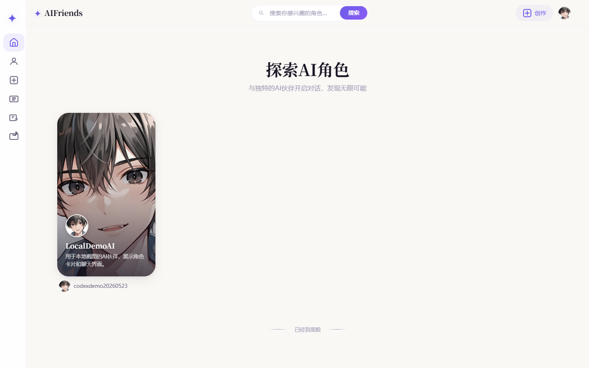
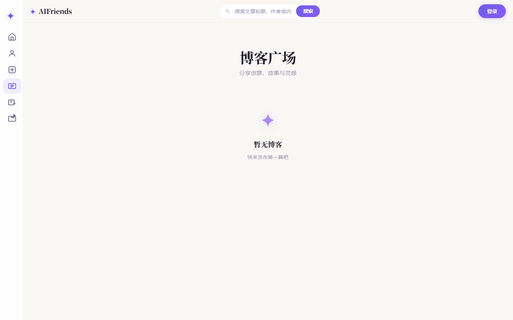
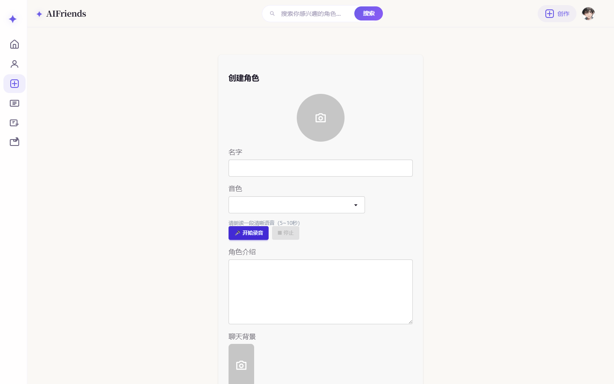

<div align="center">

# AIFriends

**基于Django 6.0 + Vue 3.0的AI角色聊天平台**

> An AI character chat platform with real-time dialogue, voice interaction, and blog system. Built with Django 6.0 + Vue 3.0. — [English](README.en.md)

[](https://www.djangoproject.com/)
[](https://vuejs.org/)
[](https://vitejs.dev/)
[](https://www.mysql.com/)
[](https://github.com/liar-ac/AI-Chat-Platform/actions/workflows/ci.yml)
[](LICENSE)

一个支持AI角色创建、实时对话、语音交互和博客系统的全栈Web应用。

</div>

---

## 功能特性

### AI角色系统
- **角色创建** — 自定义AI角色的头像、名字、人设、背景图和音色
- **音色克隆** — 基于阿里云语音服务，支持录音克隆个性化音色
- **角色广场** — 浏览和发现社区创建的AI角色

### 智能对话
- **SSE流式回复** — 实时打字机效果，体验流畅自然
- **LangGraph对话引擎** — 基于LangChain/LangGraph的多轮对话管理
- **知识库检索(RAG)** — LanceDB向量数据库支持上下文增强
- **长期记忆** — 每5轮对话自动更新角色记忆，保持连贯性
- **TTS语音合成** — 对话支持语音播放，沉浸式交互体验

### 语音交互
- **ASR语音识别** — 阿里云实时语音转文字
- **VAD语音检测** — 浏览器端Voice Activity Detection，智能断句
- **流式音频播放** — MediaSource API实现边下边播

### 博客系统
- **Markdown编辑器** — Vditor驱动，支持富文本和Markdown双模式
- **图片上传** — 编辑器内直接上传图片
- **标签分类** — 博客标签管理
- **无限滚动** — IntersectionObserver实现懒加载分页

### 用户系统
- **JWT认证** — SimpleJWT实现Access/Refresh Token双Token机制
- **个人资料** — 头像裁剪(Croppie.js)、用户名修改
- **用户空间** — 个人主页展示创作的角色和博客

## 项目截图

> 以下为截图占位，请后续替换为真实运行截图。

| 首页 | AI聊天 |
|------|--------|
|  |  |

| 博客广场 | 角色创建 |
|----------|----------|
|  |  |

## 技术栈

| 层级 | 技术 |
|------|------|
| **前端框架** | Vue 3 + Vite + Pinia + Vue Router |
| **UI组件** | Tailwind CSS + DaisyUI |
| **Markdown** | Vditor |
| **音频处理** | Web Audio API + MediaSource Extensions |
| **后端框架** | Django 6.0 + Django REST Framework |
| **认证** | SimpleJWT (Access + Refresh Token) |
| **数据库** | MySQL 8.0 |
| **向量数据库** | LanceDB (RAG知识库) |
| **AI引擎** | LangChain + LangGraph + OpenAI Compatible API |
| **语音服务** | 阿里云智能语音交互 (ASR + TTS + 音色克隆) |
| **实时通信** | Server-Sent Events (SSE) |

## 项目结构

```
AIFriends/
├── backend/                    # Django后端
│   ├── backend/                # 项目配置
│   │   ├── settings.py         # Django配置
│   │   ├── urls.py             # 根路由
│   │   └── wsgi.py             # WSGI入口
│   ├── web/                    # 核心应用
│   │   ├── models/             # 数据模型
│   │   ├── views/              # 视图层
│   │   │   ├── user/           # 用户认证与资料
│   │   │   ├── create/         # 角色创建与管理
│   │   │   ├── friend/         # 好友与聊天
│   │   │   ├── blog/           # 博客系统
│   │   │   └── homepage/       # 首页
│   │   ├── urls.py             # 业务路由
│   │   └── templates/          # Django模板
│   ├── media/                  # 用户上传文件
│   └── manage.py               # Django管理脚本
├── frontend/                   # Vue前端
│   ├── src/
│   │   ├── assets/             # 静态资源与全局样式
│   │   ├── components/         # 通用组件
│   │   │   ├── character/      # 角色卡片与聊天组件
│   │   │   └── navbar/         # 导航栏
│   │   ├── views/              # 页面视图
│   │   │   ├── homepage/       # 首页
│   │   │   ├── user/           # 用户登录/注册/资料
│   │   │   ├── create/         # 角色创建
│   │   │   ├── friend/         # 好友列表
│   │   │   └── blog/           # 博客系统
│   │   ├── stores/             # Pinia状态管理
│   │   ├── js/                 # 工具函数与API封装
│   │   │   ├── http/           # Axios实例与SSE封装
│   │   │   └── config/         # 环境配置
│   │   └── router/             # Vue Router路由
│   ├── public/                 # 公共静态文件
│   ├── index.html              # Vite入口
│   └── vite.config.js          # Vite配置
└── requirements.txt            # Python依赖
```

## 快速开始

### 环境要求

- Python 3.10+
- Node.js 20+
- MySQL 8.0+
- Conda (推荐) 或 Python venv

### 1. 克隆项目

```bash
git clone https://github.com/liar-ac/AI-Chat-Platform.git
cd AI-Chat-Platform
```

### 2. 后端配置

```bash
# 创建并激活Conda环境
conda create -n AIFriends python=3.12
conda activate AIFriends

# 安装Python依赖
pip install -r requirements.txt

# 配置环境变量
cd backend
cp .env.example .env
# 编辑 .env 填入你的配置
```

编辑 `backend/.env` 文件：

```env
# MySQL数据库配置
MYSQL_DATABASE=aifriends
MYSQL_USER=root
MYSQL_PASSWORD=your_password
MYSQL_HOST=127.0.0.1
MYSQL_PORT=3306

# AI模型配置 (OpenAI兼容接口)
API_KEY=your_api_key
API_BASE=https://api.deepseek.com
MODEL_NAME=deepseek-chat

# 阿里云语音配置 (可选，用于ASR/TTS/音色克隆)
ALI_KEY=your_ali_key
WSS_URL=your_wss_url
VOICE_URL=your_voice_url
```

```bash
# 创建数据库
mysql -u root -p -e "CREATE DATABASE aifriends CHARACTER SET utf8mb4 COLLATE utf8mb4_unicode_ci;"

# 执行数据库迁移
python manage.py migrate

# 启动后端服务
python manage.py runserver 127.0.0.1:8000
```

### 3. 前端配置

```bash
cd frontend

# 安装依赖
npm install

# 开发模式 (需要另开终端启动后端)
npm run dev

# 或者打包到Django静态目录 (推荐)
npm run build
```

### 4. 访问应用

| 模式 | 地址 |
|------|------|
| Django Serve (推荐) | http://localhost:8000/ |
| Vite Dev Server | http://localhost:5173/ |

> 使用Django Serve模式时，前端打包后由Django直接提供静态资源服务，无需单独启动Vite。

## 环境变量说明

### 后端 `backend/.env`

| 变量 | 必填 | 说明 |
|------|------|------|
| `DJANGO_SECRET_KEY` | 生产必填 | Django密钥，生产环境必须设置随机字符串，不要使用默认值 |
| `DJANGO_DEBUG` | 生产必填 | `True`仅限本地开发，**生产必须设为`False`** |
| `DJANGO_ALLOWED_HOSTS` | 生产必填 | 逗号分隔的允许域名，如`your-domain.com,www.your-domain.com` |
| `MYSQL_DATABASE` | 是 | 数据库名 |
| `MYSQL_USER` | 是 | 数据库用户名 |
| `MYSQL_PASSWORD` | 是 | 数据库密码 |
| `MYSQL_HOST` | 是 | 数据库地址 |
| `MYSQL_PORT` | 是 | 数据库端口 |
| `API_KEY` | 是 | AI模型API Key（DeepSeek/OpenAI兼容） |
| `API_BASE` | 是 | AI模型API地址 |
| `ALI_KEY` | 否 | 阿里云语音Key（ASR/TTS/音色克隆） |
| `WSS_URL` | 否 | 阿里云语音WebSocket地址 |
| `VOICE_URL` | 否 | 阿里云语音合成地址 |

### 前端 `frontend/.env`

| 变量 | 默认值 | 说明 |
|------|--------|------|
| `VITE_API_BASE_URL` | `http://127.0.0.1:8000` | 后端API地址 |
| `VITE_VAD_URL` | `http://127.0.0.1:8000/static/frontend/vad/` | VAD音频资源地址 |

## API接口

| 模块 | 接口 | 方法 | 说明 |
|------|------|------|------|
| 认证 | `/api/user/account/login/` | POST | 用户登录 |
| 认证 | `/api/user/account/register/` | POST | 用户注册 |
| 认证 | `/api/user/account/refresh_token/` | POST | 刷新Token |
| 角色 | `/api/create/character/create/` | POST | 创建角色 |
| 角色 | `/api/create/character/get_list/` | GET | 获取角色列表 |
| 对话 | `/api/friend/message/chat/` | POST | SSE流式对话 |
| 语音 | `/api/friend/message/asr/asr/` | POST | 语音识别 |
| 博客 | `/api/blog/create/` | POST | 创建博客 |
| 博客 | `/api/blog/list/` | GET | 获取博客列表 |
| 上传 | `/api/upload/image/` | POST | 图片上传 |

## 部署

### 生产环境必须配置

```env
# backend/.env — 生产环境示例
DJANGO_SECRET_KEY=your-random-50-char-string
DJANGO_DEBUG=False
DJANGO_ALLOWED_HOSTS=your-domain.com,www.your-domain.com
MYSQL_DATABASE=aifriends
MYSQL_USER=your_user
MYSQL_PASSWORD=your_strong_password
MYSQL_HOST=your_db_host
MYSQL_PORT=3306
API_KEY=your_api_key
API_BASE=https://api.deepseek.com
MEDIA_URL=https://your-domain.com/media/
CORS_ALLOWED_ORIGINS=https://your-domain.com
```

```bash
# 打包前端
cd frontend && npm install && npm run build

# 启动后端（生产推荐Gunicorn）
cd backend
pip install gunicorn
gunicorn backend.wsgi:application --bind 0.0.0.0:8000 --workers 4
```

建议在Nginx反向代理后启用HTTPS。

## 常见问题

**Q: 启动后端报`ModuleNotFoundError: No module named 'mysqlclient'`**
A: Windows用户建议使用Conda环境，`conda install mysqlclient`或`pip install mysqlclient`。Linux需先安装`libmysqlclient-dev`。

**Q: 前端页面空白，控制台报CORS错误**
A: 确认`backend/.env`中`CORS_ALLOWED_ORIGINS`包含前端访问地址，或`DJANGO_ALLOWED_HOSTS`包含当前域名。

**Q: 浏览器标签页标题或图标不对**
A: 执行`npm run build`重新打包，Django模板中的资源文件名会自动同步。强刷`Ctrl+Shift+Delete`清除缓存。

**Q: AI对话没有回复**
A: 检查`backend/.env`中`API_KEY`和`API_BASE`是否正确配置。需要DeepSeek或OpenAI兼容API密钥。

**Q: 博客广场空白**
A: 确认后端已启动且数据库已执行`python manage.py migrate`。打开浏览器控制台查看具体错误。

## 安全提醒

> **生产环境必须遵守以下安全规则：**

1. **永远不要提交`.env`文件到Git** — 使用`.env.example`作为模板
2. **必须设置`DJANGO_SECRET_KEY`为随机字符串** — 不要使用代码中的默认值
3. **必须设置`DJANGO_DEBUG=False`** — `True`仅限本地开发
4. **历史泄露密钥必须轮换** — 如果曾将密钥提交到Git，即使已删除文件，历史中仍可访问。立即在对应平台轮换密钥
5. **数据库密码必须使用强密码** — 不要使用简单密码
6. **详见[SECURITY.md](SECURITY.md)**

## 贡献

欢迎提交Issue和Pull Request！详见[CONTRIBUTING.md](CONTRIBUTING.md)。

## 开源协议

本项目基于 [MIT License](LICENSE) 开源。

## 致谢

- [Django](https://www.djangoproject.com/) — Web框架
- [Vue.js](https://vuejs.org/) — 前端框架
- [LangChain](https://www.langchain.com/) — AI应用框架
- [DaisyUI](https://daisyui.com/) — Tailwind CSS组件库
- [Vditor](https://b3log.org/vditor/) — Markdown编辑器
- [阿里云智能语音](https://www.aliyun.com/product/nls) — 语音服务
